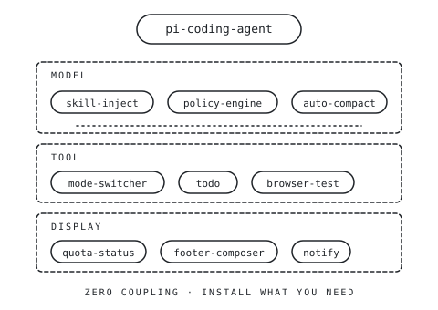

<!-- markdownlint-disable MD033 MD041 -->
<p align="center">
  
</p>

# pi-plugin

<p align="center"><strong>Independent extensions for Pi Coding Agent.</strong></p>

<p align="center">8 extensions · zero coupling · install only what you need</p>

<p align="center">
  <a href="https://github.com/huangrx6/pi-plugin/actions/workflows/ci.yml"></a>
  
  
</p>

---

## Why pi-plugin

Pi Coding Agent ships a clean extension contract. This repository is a curated set of independent extensions that follow it — each one solves a specific problem, and none of them depend on the others. Pick the ones that match your workflow; skip the rest.

Every extension lives in its own directory as an independently publishable Pi package. There are no shared utilities, no inter-extension imports, and no cross-extension tests. If you remove one extension from your install, the others keep working unchanged.

## Extensions

### MODEL — affects the model's behavior

| Extension | Purpose |
| --- | --- |
| [skill-inject](./extensions/pi-skill-inject/README.md) | Inline skill loading with autocomplete and expandable activity records. |
| [policy-engine](./extensions/pi-policy-engine/README.md) | Adaptive workflow routing with an auditable explanation of each actual injection. |
| [context-qos](./extensions/pi-context-qos/README.md) | Working-context maintenance that resumes interrupted work after successful compaction. |

### TOOL — intercepts tool calls

| Extension | Purpose |
| --- | --- |
| [mode-switcher](./extensions/pi-mode-switcher/README.md) | Approval gate with a safe independent selector: ask / smart / full. |
| [todo](./extensions/pi-todo/README.md) | Workspace task list with contextual actions and an optional two-line editor strip. |

### DISPLAY — presents terminal state

| Extension | Purpose |
| --- | --- |
| [quota-status](./extensions/pi-quota-status/README.md) | Independent quota panel for subscription windows, balances and API-key allowances. |
| [footer-composer](./extensions/pi-footer-composer/README.md) | Optional compact/full footer that can switch back to Pi's native footer at runtime. |
| [notify](./extensions/pi-notify/README.md) | Terminal-aware completion notification with transport diagnostics and a test surface. |

Every extension keeps its own command or conversation entry for its primary interaction. The footer only summarizes information; removing or disabling it does not remove task operations, quota details, policy explanations, context controls, permission selection, skill history, or notification diagnostics.

## Choose by workflow

These combinations tend to work well together. They are not coupled — each extension is still installed independently.

- **Safer agent execution** — mode-switcher + policy-engine
- **Long coding sessions** — context-qos + todo
- **Terminal UX** — footer-composer + quota-status + notify

## Quick start

Install the whole suite:

```bash
pi install git:github.com/huangrx6/pi-plugin
```

Restart Pi or run `/reload`. That's it.

## Architecture

<p align="center">
  
</p>

Each extension sits in exactly one layer (MODEL / TOOL / DISPLAY). There are no arrows between extensions — they communicate only through Pi's public extension contract.

## Installation

### `pi install` (recommended)

```bash
pi install git:github.com/huangrx6/pi-plugin
```

Restart Pi or run `/reload`. To upgrade later: `pi update --extensions`.

### `bin/install.sh` (interactive)

The repository ships `bin/install.sh`, an interactive installer that clones the monorepo into a chosen directory, lets you pick which extensions to enable, and symlinks each one into Pi's extension directory.

```bash
bash <(curl -fsSL https://raw.githubusercontent.com/huangrx6/pi-plugin/main/bin/install.sh)
```

The script asks which extensions to install, where to install them, and creates parent directories if they don't exist. To upgrade after installation: `cd <install-dir>/_huangrx6-pi-plugin && git pull`, then `/reload`.

<details>
<summary>Manual install (one extension at a time, or symlink)</summary>

To install a single extension directly as a Pi package:

```bash
pi install git:github.com/huangrx6/pi-plugin/extensions/pi-skill-inject
```

To install the whole monorepo via symlinks (no `pi install` needed):

```bash
git clone --depth 1 https://github.com/huangrx6/pi-plugin \
  ~/.pi/agent/extensions/_huangrx6-pi-plugin
for ext in ~/.pi/agent/extensions/_huangrx6-pi-plugin/extensions/*/; do
  ln -sfn "$ext" ~/.pi/agent/extensions/$(basename "$ext")
done
```

</details>

## Development

Each extension has its own `check` and `test` scripts:

```bash
cd extensions/<name>
npm install     # TS extensions only
npm run check
npm test
```

CI runs every extension's check + test independently. See `.github/workflows/ci.yml` for the matrix.

Adding a new extension: create `extensions/<name>/`, register it in the root `package.json`'s `pi.extensions` array, and add a matching CI job. Full repo conventions live in [AGENTS.md](./AGENTS.md).

## Requirements

- Node.js `>=22.15` — extensions use `node:sqlite`, `node:zlib` (zstd), and FTS5, all built-in on Node 22+
- Pi Coding Agent, any recent version that supports the extension contract

## License

MIT © huangrx6
